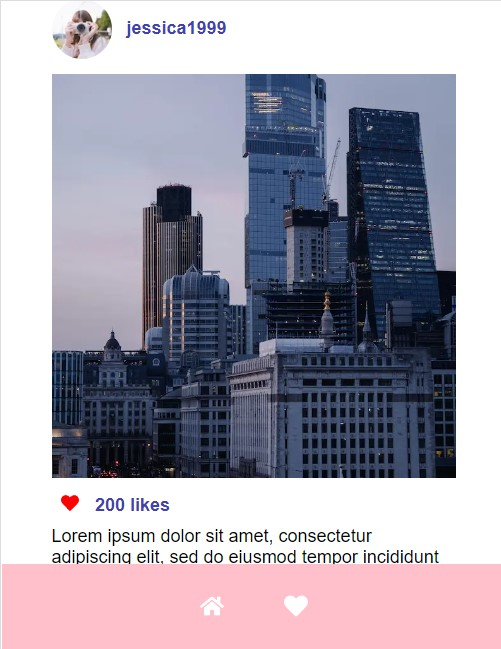

# PhotoStoryboard 
 This is a [Next.js](https://nextjs.org/) project bootstrapped with [`create-next-app`](https://github.com/vercel/next.js/tree/canary/packages/create-next-app).

 The app has 2 pages. 1) Posts listing 2) Favorite posts listing. 
 When the user hits the heart icon, it will be added to an array in local storage , and the heart icon will be highlighted.
 When they go to the favorites page, they will see their favorite posts.
 
 
 # Getting Started
 First, run the development server: ```npm run dev # or yarn dev # or pnpm dev ```
 Open [http://localhost:3000](http://localhost:3000) with your browser to see the result. 
 You can start editing the page by modifying `pages/index.js`. 
 The page auto-updates as you edit the file. 
